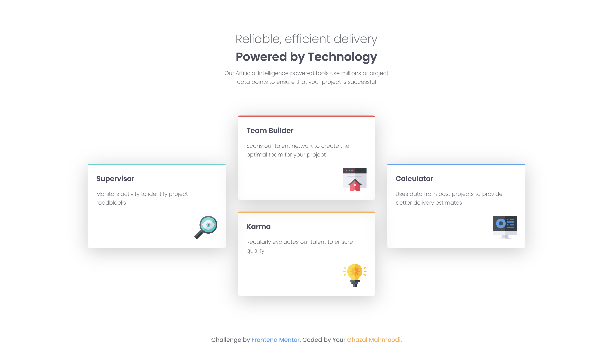

# Four card feature section by [Frontend Mentor](https://www.frontendmentor.io/challenges/four-card-feature-section-weK1eFYK)

## Screenshot

## Useful Links
here are some useful links that helped me complete this project recommended by Frontend Mentor
[flexbox](https://www.joshwcomeau.com/css/interactive-guide-to-flexbox/)
[flexbox frogy](https://flexboxfroggy.com/)

## Project Status 
completed

## What I Learned and Continue Learning
I knew the basics of flexbox, and i thought it will complete the work. but there are some tricky parts about this layout that need deep undestanding of flexboxes and media queries.
In the future I am going to practice more on these topics

## Challenge
Is there a way of building it without using media quesries?

## Contact me
[email me at](ghazalmahmoodi23@gmail.com)